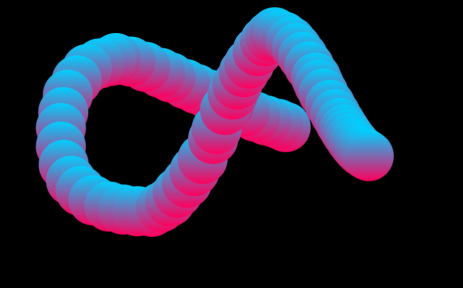
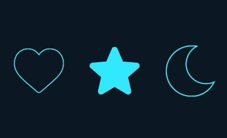
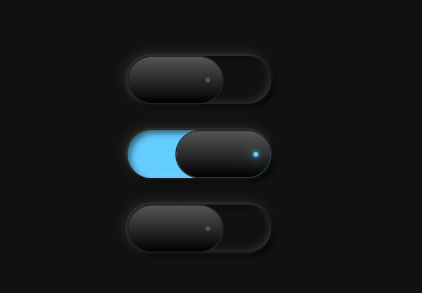
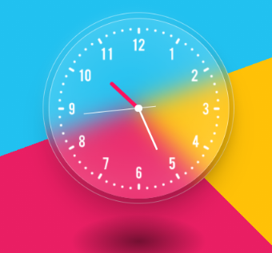
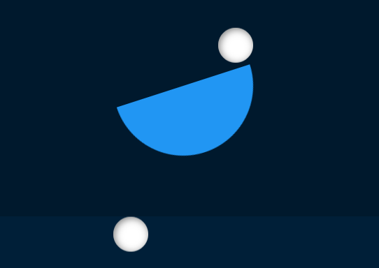
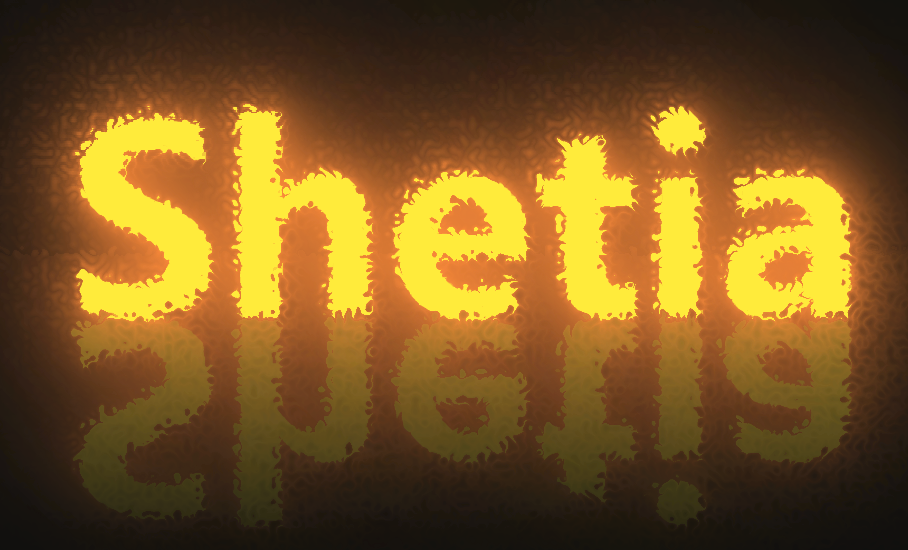
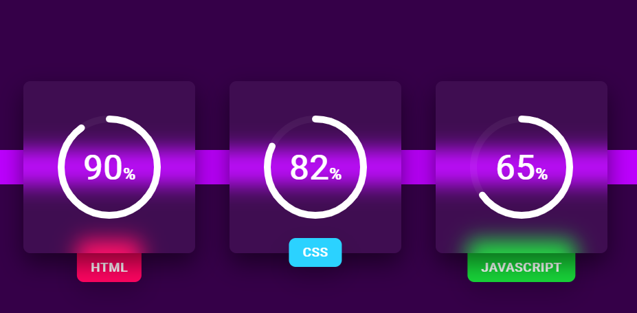
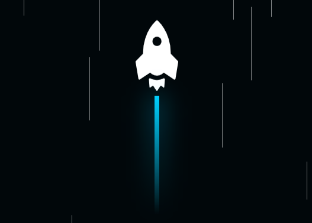
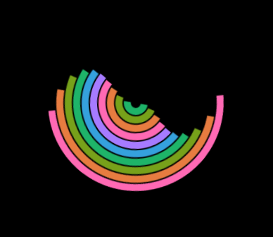

# css-effects

各种css html js 特效集合

#### 1.用鼠标画一条蛇

#### 2.用CSS对SVG图标进行动画处理

#### 3.CSS自定义单选按钮特效

#### 4.玻璃效果时钟特效

#### 5.CSS加SVG液态加载动画特效

#### 6.纯CSS弹跳小球动画特效

#### 7.火焰文本动画效果

#### 8.纯 CSS 实现的圆形进度条

#### 9.带有火焰动画效果的飞行火箭

#### 10.CSS波浪加载动画特效

